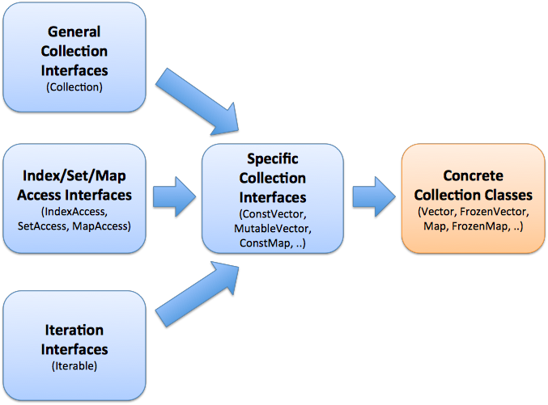

##更多介绍

以下对集合（Collections）的一些特性做进一步的描述。

###不可变动的集合

Hack中的集合有两种基本形式：可变的和不可变的。可变的`Vector`，`Map`和`Set`都有其不可变的对应。不可变的集合就是常量集合。不能增加也不能删除元素，也不能对元素进行赋值。

不可变集合通常实现了一个ConstXYZ接口（如：`ConstVector`）。目前Hack中有如下几个不可变集合类：

* `ImmVector`
* `ImmMap`
* `ImmSet`

###集合接口

下面这张图展示了Hack集合的接口是如何构建的：



在设计Hack集合时，遵循了如下的设计模式：

1. 在各种代码中使用了PHP开发者习惯的模式，如`foreach`进行键/值遍历或者只是值遍历。
2. 允许使用`foreach`，括号语法（`$a[$b]`）以及更高优先级的函数（如`filter`），而不用人工对遍历子进行操作。
3. 未来可以支持类型协变（covariance）和类型逆变（contravariance），在保持类型安全性的同时提供最大化的功能和灵活性。
4. 为最大化地满足开发者的要求，在合适的情况下，跟随了其它常见集合框架的设计模式。

###特殊集合接口

我们看一些特殊的集合接口。

“常量”接口（`ConstVector`，`ConstMap`和`ConstSet`）可以用来限定参数类型，表明某个函数不应修改该集合。每个“常数”接口都有一个“可变”接口对应。

####遍历接口

`Iterable`，`Traversable`和相应的接口允许对来自某个来源的值或者键/值进行遍历，而不论来源是集合还是生成子或者别的类型的对象。

`Traversable`形式的接口与`foreach`连用，提供一个元素的连续反馈。`Traversable`还提供了代码与数组和集合兼容的能力，同时允许键和值的类型。比如，一个函数如果接受参数是`Indexish`，那么传递进去的参数可以是`array<int>`或者`Vector<int>`。

`Indexish`是另外一个可同时与数组和集合工作的接口。它的目的是简化从数组到类型化集合的迁移。`Indexish`支持类似数组的方括号语法：`$x[$k]`，也支持通过`foreach`的迭代（经由对`Traversable`接口的扩展）。`Indexish`接口不包括那些改变数组或集合的功能（如添加、删除、改变元素类型、改变元素值）。虽然`Indexish`确实不提供修改的功能，但还是有可能来修改数组和集合，只要程序员用`is_array()`或者`instanceof`将容器类型转换到其实际类型，或者容器被传给了“无类型”代码。

需要说明的是，在使用`Indexish`时，拷贝语义仍然对数组和集合有效。数组是“写时拷贝”的，而集合通过引用传递。

`Indexish`支持键集合，`Vector`和`Map`实现了`Indexish`，`Set`（它没有键）和`Pair`没有实现。

`Iterable`形式的接口允许用`foreach`在给特定的时候通过使用迭代子（如`next`）获得值，同时也提供各种帮助函数在迭代时使用。

###一般集合接口
`Collection`接口提供基本函数来增加和删除元素，以及用统一的方式来进行元素的迭代。


####存取接口

根据实现的集合类型，会实现如下接口中的一种：`IndexAccess`，`SetAccess`和`MapAccess`。这些接口提供了如下功能：通过索引/键在一个集合中检查值，通过索引/键在集合中删除项目，提供`[]`语法来通过索引/键存取值。这三个接口都有一个“常量”对应项。

###`[]`语法

Hack的集合类提供两种基本的方法存取元素：方括号方式和显式的`get`/`set`方法。推荐使用`[]`语法：

* 运行时速度较快；
* 阅读代码较方便；
* 需要支持集合和数组的代码需要`[]`，也要为了兼容而实现`KeyedTraversable`和`Indexish`。

###常量语法

Hack引入了常量语法以便创建一个新的集合而不需用到临时数组或其它函数。例如:

```
<?hh
$vec=Vector {1, 2, 3};
```
下面是更详细的例子:

```
<?hh
/** 本例程展示了Hack中集合的常量构造的用法。
* 详细内容见http://taylorr.gitbooks.io/learn-hack-together/content/03.04.05%20more.html。
*/

function f() {
  $vec = Vector {1, 2, 3};
  var_dump($vec);
  $map = Map {42 => 'foo', 73 => 'bar', 144 => 'baz'};
  var_dump($map);
}

f();
```
选择这种常量语法而不是别的语法有几个原因:

* `[...]`语法已经在PHP 5.4中作为数组语法使用。
* 现在的集合常量语法和函数调用语法区分明显，可以区别对待，并提供与PHP数组匹配的性能。这也意味着不需要加入新的语法来允许在`map(...)`中而不是在函数调用中使用"=>"。
* 这一语法为将来加入内置集合类型提供可扩展性。该语法也为某些用户定义的类使用提供了可能。
* 提供了可能性指定集合的扩展类型，例如:`Vector<Foo> }f(), g()}`。一旦泛型整合入类型系统，也会有用。
* 这个语法比较简单。但不排除将来出现更简明的向量和映射语法的可能。
* 该语法与各种常用语言的初始构造函数类似。
